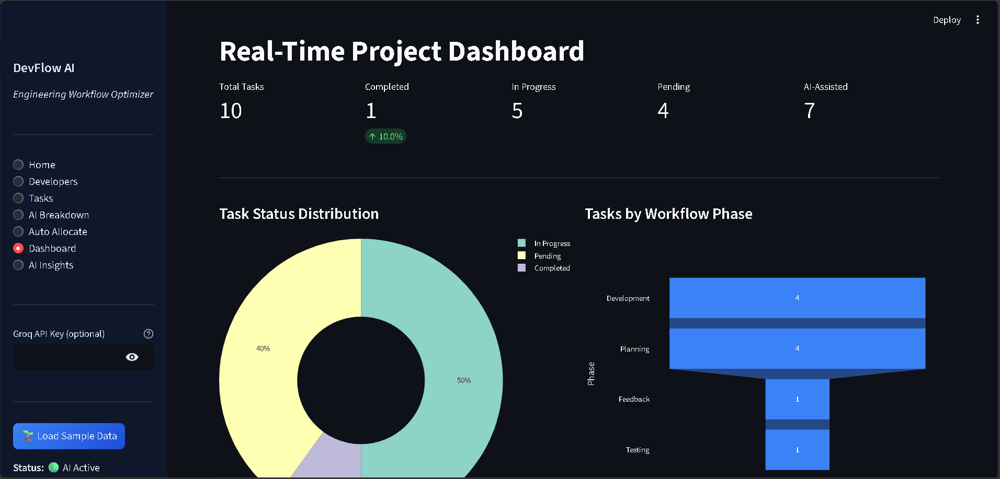
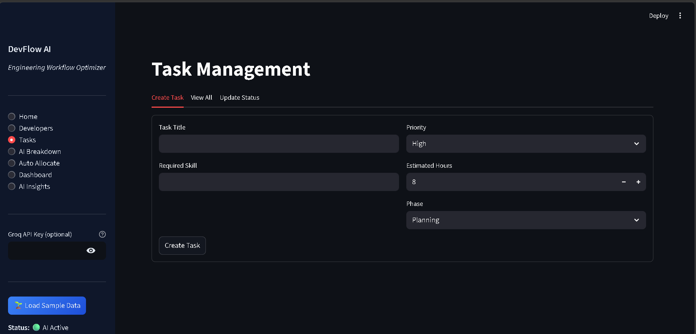
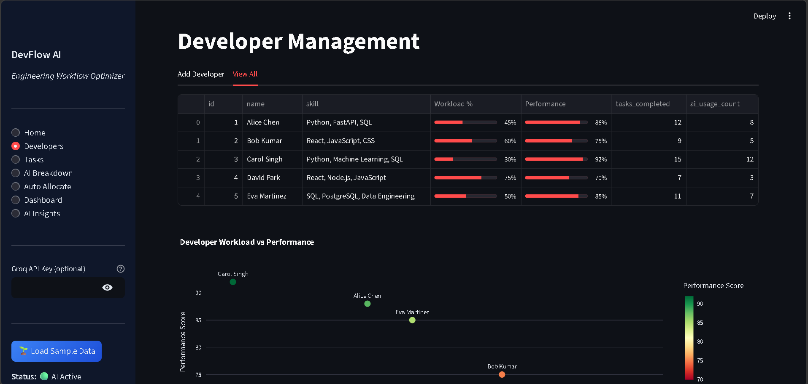
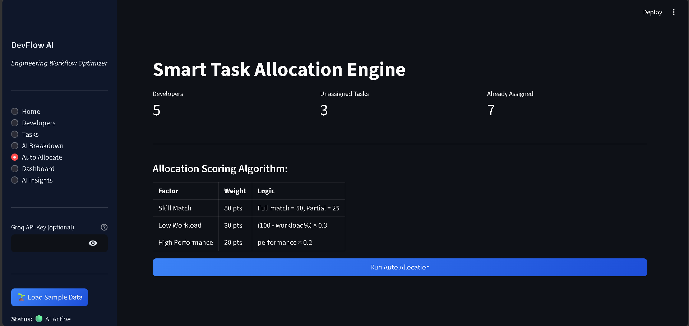

# DevFlow AI: Engineering Workflow & Resource Optimization System
## Project Overview
DevFlow AI is an intelligent management platform designed to structure the software development lifecycle (SDLC) through AI-assisted workflows. The system addresses common team bottlenecks—such as inefficient task allocation and poor visibility into developer productivity—by utilizing a data-driven approach to resource management.
This prototype demonstrates a full-stack solution featuring an Allocation Engine, a Real-time Analytics Dashboard, and AI-powered Project Decomposition.

## System Architecture & Approach
The system is built using a modular architecture to ensure scalability and clear separation of concerns, as requested in the problem statement.
1. High-Level Architecture
   - Frontend : Built with Streamlit to provide a real-time, interactive dashboard for managers and developers.
   - Logic Layer : A Python-based core that handles the Weighted Scoring Algorithm for task allocation and communicates with the LLM via the Groq API.
   - Database : A SQLite relational database that tracks developer metrics, task history, workflow phases, and AI interaction logs.
2. The Allocation Engine
   The core of the system is the calculate_allocation_score function. Instead of basic manual assignment, it uses a weighted formula to identify the best resource for a task:
     - Skill Match (50%): Prioritizes developers with matching or partial skill sets.
     - Workload Balance (30%): Automatically favors underutilized developers to prevent burnout.
     - Performance Metrics (20%): Factors in historical performance scores to ensure quality output.
3. AI Integration Strategy
   - Planning Phase: Uses Llama-3-8b to break down high-level project descriptions into manageable, phase-based subtasks (Planning, Development, Testing, Feedback).
   - Management Insights: Provides a "Risk & Bottleneck" analyzer that scans the current team state and suggests actionable rebalancing strategies.

## Database Schema
The system utilizes four main relational tables:
  - developers: Tracks skills, workload, and performance scores.
  - tasks: Manages lifecycle status, priority, and assigned resources.
  - ai_logs: Captures the history of AI usage across different phases.
  - workflow_phases: Tracks the timeline of each task through the SDLC.

## Tech Stack
- Frontend: Streamlit  
- Backend: Python  
- Database: SQLite  
- Data Processing: Pandas  
- Visualization: Plotly  

## Installation & Setup
### Prerequisites
  - Python 3.8+
  - Groq API Key (Optional; the system includes an Intelligent Mock Mode for offline evaluation)

### Steps
1. Clone the repository:
   git clone https://github.com/your-username/devflow-ai.git
   cd devflow-ai
2. Install dependencies:
   pip install streamlit pandas plotly requests
3. Run the application:
   streamlit run app.py
4. Load Sample Data: Click the "Load Sample Data" button in the sidebar to immediately populate the dashboard and test the allocation engine.

## Screenshots

### Dashboard

### Task Creation

### Developer Page

### Live link
https://devflow-ai-d3xt5hkv4yefehxhy487gw.streamlit.app/

### Allocation

# Author
Nishita Poojary
